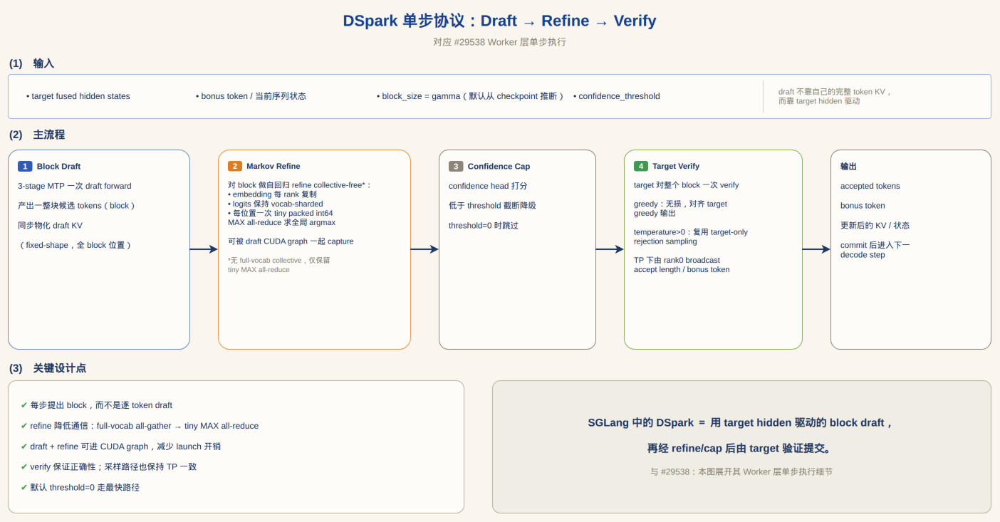
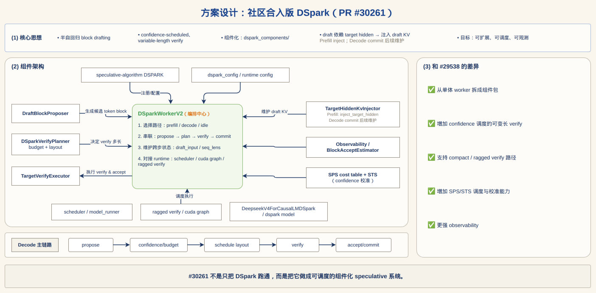
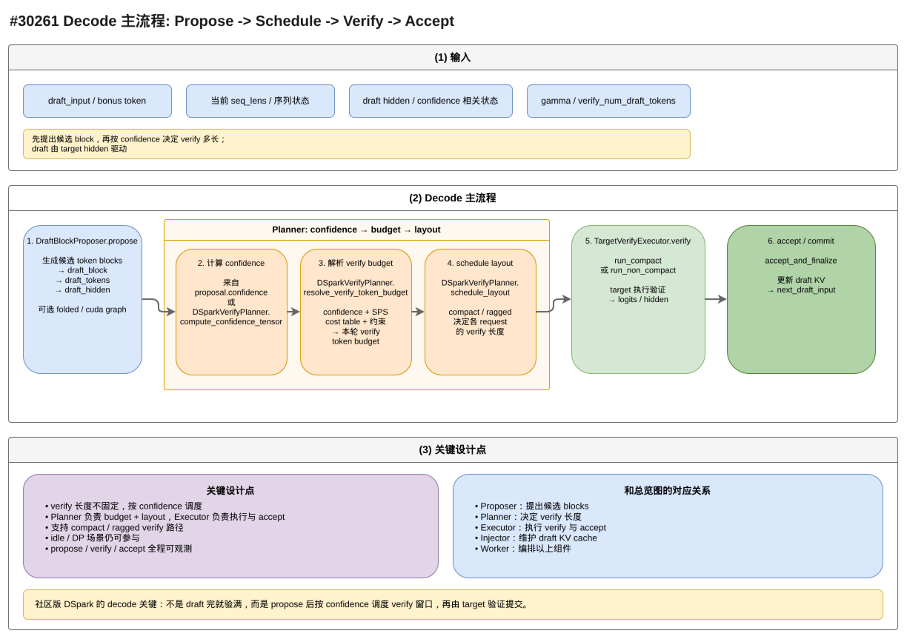
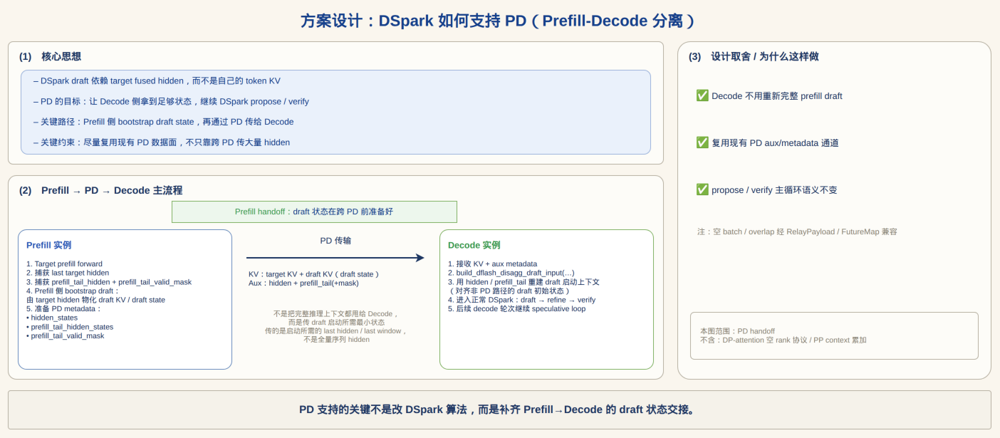
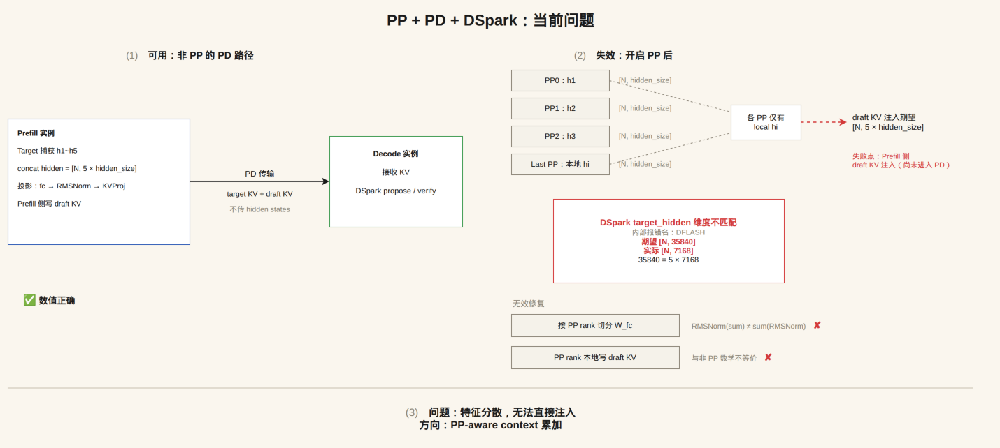
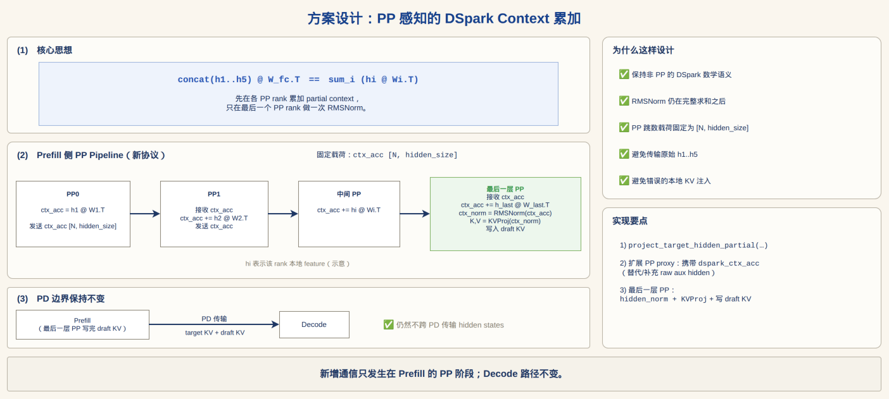

# DSpark（SGLang 社区版）调研文档

> 基于 SGLang 社区 DSpark 相关 PR（含已合入、未合入与已关闭）整理，覆盖算法协议、工程架构、调度机制、PD 分离、PP 支持及生态现状。
> 六张配套架构图（`.drawio` 可编辑源文件）位于本目录：
> `dspark-decode-main-flow` / `dspark-design-overview` / `dspark-single-step-protocol` / `dspark-pd-support` / `dspark-pp-context-accumulation` / `dspark-pp-pd-problem`。
>
> 调研时间：2026-07-30。未合入 PR 的内容后续可能变化。

---

## 1. DSpark 是什么

DSpark 是 **DeepSeek-V4 原生自带的 block 级投机解码（speculative decoding）drafter**：

- 一个 **3-stage MTP（multi-token prediction）栈**，附带 **Markov refinement head** 和 **confidence head**；
- 每个 decode step 基于 **target 模型的 fused hidden states** 一次性起草（draft）一整块（block）候选 token，而不是逐 token 起草；
- 参考实现：[deepseek-ai/DeepSpec](https://github.com/deepseek-ai/DeepSpec)；模型权重如 [DeepSeek-V4-Pro-DSpark](https://huggingface.co/deepseek-ai/DeepSeek-V4-Pro-DSpark)。

社区诉求由 issue [#29488](https://github.com/sgl-project/sglang/issues/29488)（Support DSpark Speculative Decoding for DeepSeek V4）提出，SGLang 侧的落地经历了"单体实现（closed）→ 组件化重构（merged）"两个阶段，之后围绕 PD 分离、PP、多硬件、多模型展开了大量后续 PR。

**与传统 EAGLE 式投机解码的核心区别：**

| 维度 | EAGLE 家族 | DSpark |
|---|---|---|
| 起草粒度 | 逐 token（tree/chain） | 一次一整块（block） |
| draft 依赖 | 自己的 token KV | target fused hidden 驱动（不依赖自己的完整 token KV） |
| verify 长度 | 固定 | confidence-scheduled，可变长（#30261） |
| 精度保证 | 无损（greedy）/采样 | greedy 无损；temperature>0 复用 target-only rejection sampling |

---

## 2. PR 全景与时间线

### 2.1 核心主线

| PR | 状态 | 内容 |
|---|---|---|
| [#29538](https://github.com/sgl-project/sglang/pull/29538) | **CLOSED**（未合入） | 首个完整实现：`speculative/dspark_worker_v2.py` 单体 worker + `models/deepseek_v4_dspark.py`。奠定单步协议（Draft → Refine → Verify）与全部性能优化（collective-free refine、draft CUDA graph、fixed-shape draft KV 等） |
| [#30261](https://github.com/sgl-project/sglang/pull/30261) | **MERGED** | 最终合入版：组件化重构为 `speculative/dspark_components/` 包；新增 **confidence-scheduled 可变长 verify**（Planner + SPS 成本表 + STS 校准 + compact/ragged verify） |

#29538 与 #30261 的差异（对应图 2 右栏）：
1. 从单体 worker 拆成组件包（`dspark_components/`）；
2. 增加 confidence 调度的可变长 verify（#29538 是固定 gamma+1 窗口）；
3. 支持 compact / ragged verify 路径（`ragged_verify.py` + 专用 kernels）；
4. 增加 SPS（cost table）/ STS（confidence 校准）调度与校准能力；
5. 更强 observability（`dspark_observability.py`、`BlockAcceptEstimateRecorder`、metrics）。

### 2.2 PD（Prefill-Decode 分离）支线

| PR | 状态 | 内容 |
|---|---|---|
| [#31513](https://github.com/sgl-project/sglang/pull/31513) | OPEN | 修复 `--disaggregation-mode decode` 下 DSPARK/DFLASH 崩溃：新增 `build_dflash_disagg_draft_input`（DFLASH/DSPARK 家族共用），接通 overlap relay（`FutureMap` / `RelayPayload` 只中继 bonus_tokens） |
| [#30513](https://github.com/sgl-project/sglang/pull/30513) | CLOSED | PD + DeepEP 首版：decode 侧 bootstrap（跨 PD 传 target hidden，decode 注入 draft KV）；引入 `DSparkHiddenTransferPlan` / `DSparkHiddenPagePool` |
| [#31466](https://github.com/sgl-project/sglang/pull/31466) | OPEN | PD 完整方案（#30513 的演进）：新增 `DSPARK_HIDDEN` 状态类型，Mooncake/NIXL 行寻址传输 + Mooncake 流式传输，`prefill_tail_hidden_states` / `prefill_tail_valid_mask` 元数据，PP-aware 捕获 |
| [#32422](https://github.com/sgl-project/sglang/pull/32422) / [#32423](https://github.com/sgl-project/sglang/pull/32423) / [#32424](https://github.com/sgl-project/sglang/pull/32424) | OPEN | #31466 拆成的三段式 stack：1/3 传输原语与注入（`PDHiddenRowPool`/`PDHiddenTransferPlan`）；2/3 接入 PD 调度与 PP 协调；3/3 Mooncake 流式传输（READY/ACK 流控、`PDHiddenEventManager`） |

**注意：社区在 PD 上有两条并行路线**（图 4 综合了两者，细节见 §7）：
- **A. decode 侧 bootstrap**（#30513 → #31466 → #32422-24）：跨 PD 传 target hidden（流式/行寻址），decode 侧重建 draft 上下文并注入 draft KV；
- **B. prefill 侧 bootstrap**（#32750 描述的 Kimi-K3 现状路径）：prefill 本地物化 draft KV，跨 PD 只传 target KV + draft KV，**不跨 PD 传 hidden**。

### 2.3 PP（流水线并行）支线

| PR | 状态 | 内容 |
|---|---|---|
| [#31139](https://github.com/sgl-project/sglang/pull/31139) | OPEN | 前置：PP + EAGLE（eagle_worker_v2） |
| [#32281](https://github.com/sgl-project/sglang/pull/32281) | OPEN | PP + DSpark（非 PD）：draft 模型只在最后一个 PP rank；新增 `DSparkPPVerifyInputRaw` 跨 PP ring 中继 draft/confidence/accounting；per-layer aux hidden 以 `"dspark_aux"` key 经 `PPProxyTensors` 下传，最后 rank 按全局层序重组 |
| [#32793](https://github.com/sgl-project/sglang/pull/32793) | OPEN | **PP + PD + DSpark**（修复 [#32750](https://github.com/sgl-project/sglang/issues/32750)）：PP-aware context 累加协议（详见 §8-9，对应图 5/图 6） |

### 2.4 生态 / 硬件 / 模型支线（部分）

| 方向 | PR |
|---|---|
| AMD/ROCm | [#31026](https://github.com/sgl-project/sglang/pull/31026)（MI350X/MI355X gfx950）、[#30964](https://github.com/sgl-project/sglang/pull/30964)、[#31260](https://github.com/sgl-project/sglang/pull/31260)、[#31457](https://github.com/sgl-project/sglang/pull/31457)、[#32630](https://github.com/sgl-project/sglang/pull/32630)（top-k/top-p renorm torch fallback） |
| GLM-5.2 | [#31047](https://github.com/sgl-project/sglang/pull/31047)、[#30720](https://github.com/sgl-project/sglang/pull/30720)（compact verify） |
| 其它模型 | [#31041](https://github.com/sgl-project/sglang/pull/31041)（LFM2/LFM2-MoE）、[#32504](https://github.com/sgl-project/sglang/pull/32504)（Qwen3.6 GDN recurrent state commit）、[#32828](https://github.com/sgl-project/sglang/pull/32828)（Kimi DCP + DSPARK draft KV pool OOB）、[#31847](https://github.com/sgl-project/sglang/pull/31847)（inkling dspark）、[#31397](https://github.com/sgl-project/sglang/pull/31397)（Qwen3.6-35B-FP8 配置文档） |
| MoE 后端 | [#31868](https://github.com/sgl-project/sglang/pull/31868)（DeepEP & DeepGemm） |
| 能力扩展 | [#31414](https://github.com/sgl-project/sglang/pull/31414)（dense draft model）、[#32035](https://github.com/sgl-project/sglang/pull/32035)（c128 online compressor）、[#31451](https://github.com/sgl-project/sglang/pull/31451)（SPS fit 诊断）、[#32010](https://github.com/sgl-project/sglang/pull/32010)（DSA 后端 ragged verify graphs）、[#31422](https://github.com/sgl-project/sglang/pull/31422)（DSA compact-verify + sync-free verify-all） |
| Bugfix/优化 | [#31016](https://github.com/sgl-project/sglang/pull/31016)（CUDA graph capture 用 runtime gamma）、[#31195](https://github.com/sgl-project/sglang/pull/31195)（verify budget 跨 TP 广播对齐 compact graph tier）、[#30982](https://github.com/sgl-project/sglang/pull/30982)（speculators 约定 checkpoint，gamma+1 宽 draft block）、[#32930](https://github.com/sgl-project/sglang/pull/32930)（full-window fast path 尊重 partial budget）、[#32183](https://github.com/sgl-project/sglang/pull/32183)（verifier state rewrite window）、[#32374](https://github.com/sgl-project/sglang/pull/32374)（纯 TP 下移除 overlap scheduler host sync）、[#32186](https://github.com/sgl-project/sglang/pull/32186)（减少 import 副作用）、[#32467](https://github.com/sgl-project/sglang/pull/32467)（c128 prefill plan kernel race） |

---

## 3. 单步协议：Draft → Refine → Verify（对应图 3，来源 #29538）

单个 decode step 内的 Worker 层执行细节：

**输入**：target fused hidden states、bonus token / 当前序列状态、`block_size = gamma`（默认从 draft checkpoint 的 `block_size` 自动推断；verify 窗口 = gamma + 1）、`confidence_threshold`。draft 不靠自己的完整 token KV，而是由 target hidden 驱动。

1. **Block Draft** — 3-stage MTP 一次 draft forward，产出一整块候选 tokens；draft KV **fixed-shape 物化**（对全 block 位置无条件写入，消除数据相关的 host sync）。
2. **Markov Refine（collective-free）** — 对 block 做自回归 refine。原实现每 decode step 需 11 次 NCCL collective（6 次 full-vocab all-gather + 5 次 embedding all-reduce）；优化后：
   - Markov embedding 每 rank 复制（约 66 MB）；
   - refined logits 保持 vocab-sharded；
   - 每个 block 位置只做一次 **tiny packed int64 MAX all-reduce** 求全局 argmax（打包精确复现 `torch.argmax` 的 first-index tie-break，对 100 万+ 行强制平局做过单元测试，draft 结果 bit-identical）；
   - 整个 refine 循环可被 **draft CUDA graph 一起 capture**（`dspark_draft_sampler` hook，去掉约 30 个 eager kernel launch + 一个 Python 循环）。
3. **Confidence Cap** — confidence head 打分，低于 threshold 截断降级；**threshold=0（默认、实测最快）时该计算被整体跳过**（dead-code elimination）。
4. **Target Verify** — target 对整个 block 一次 verify：
   - greedy：无损，对齐 target greedy 输出；
   - temperature>0：复用 target-only speculative rejection sampling 原语（与 DFLASH 同一套），尊重 per-request temperature/top_k/top_p；缺 `sgl_kernel` ops 时回退 greedy 并打一次性警告；
   - TP 下 accept length / bonus token 由 **rank 0 broadcast**，保证各 rank 提交一致（镜像 EAGLE 的 post-kernel broadcast）。
5. **输出** — accepted tokens、bonus token、更新后的 KV/状态；commit 后进入下一 decode step。

**关键设计点**：块级提出而非逐 token；refine 通信从 full-vocab all-gather 降为 tiny MAX all-reduce；draft + refine 可进 CUDA graph；verify 保证正确性（采样路径 TP 一致）；默认 threshold=0 走最快路径。

**不支持的请求类型**（预先拒绝而非静默降级）：`return_logprob`、grammar 约束解码（JSON schema / regex / EBNF / structural tags）、`return_hidden_states`。

---

## 4. 组件化架构（对应图 1 / 图 2，来源 #30261）

合入版将 DSpark 拆为 `python/sglang/srt/speculative/dspark_components/` 组件包（类名均已对照 main 分支源码核实）：

| 组件 | 文件 | 职责 |
|---|---|---|
| `DSparkWorkerV2` | `dspark_worker_v2.py` | 编排中心：选择路径（prefill/decode/idle）、串联 propose → plan → verify → commit、维护跨步状态（draft_input / seq_lens）、对接 runtime（scheduler / cuda graph / ragged verify） |
| `DraftBlockProposer` | `dspark_draft.py` | `propose()` 生成候选 token block（`DraftProposal`：draft_block/draft_tokens/draft_hidden）；`run_idle_participation()` 保证 idle/DP 场景参与；可选 folded / cuda graph 路径 |
| `DSparkVerifyPlanner` | `dspark_planner.py` | `compute_confidence_tensor()` → `resolve_verify_token_budget()`（结合 confidence、SPS 成本表、约束得到本轮 verify token budget）→ `schedule_layout()`（决策 compact/ragged，决定每个 request 验证多长，`VerifyWindow`） |
| `TargetVerifyExecutor` | `dspark_verify.py` | `run_compact()` / `run_non_compact()` 执行 target verify；`accept_and_finalize()` 提交；`DsparkVerifyEpilogue` 折叠 accept/commit 进 graph |
| `TargetHiddenKvInjector` | `dspark_kv_inject.py` | `inject_target_hidden()` / `inject_ragged()`：维护 draft KV（Prefill 注入；Decode commit 后续维护） |
| `BlockAcceptEstimateRecorder` | `dspark_block_accept_estimator.py` | 块接受率估计与在线 ceiling 观测 |
| Observability | `dspark_observability.py` | 指标与 info dump |
| SPS | `dspark_sps.py` | `SpsCostTable` / `SpsAdditiveCostTable`：离线 profile（`sglang.benchmark.dspark_sps_profiler`）的 verify 成本表，供 budget 决策 |
| STS | `dspark_sts.py` | `DSparkStsCalibration`：per-position sequential temperature scaling 校准（`sglang.benchmark.dspark_sts_fit`），校准 confidence |
| kernels | `kernels/` | accept / attn_metadata / draft_model / schedule / verify_window 等 Triton kernels |

模型侧：`models/deepseek_v4_dspark.py`（`DeepseekV4ForCausalLMDSpark`，3-stage MTP，target-layer capture，heads 读 config 兼容 Flash/Pro）与 `models/dspark.py`；draft 的 `embed_tokens` / `lm_head` 绑定 target 已加载权重。

配置：`--speculative-algorithm DSPARK`、`--speculative-dspark-block-size`（默认从 checkpoint 推断 gamma）、`--speculative-dspark-confidence-threshold`、`--speculative-dspark-sps-table-path`、`--speculative-dspark-confidence-sts-path`、`--speculative-dspark-align-verify-tokens-to-graph-tier`。

**Decode 主流程六步**（对应图 1）：
`DraftBlockProposer.propose` → ② 计算 confidence（来自 `proposal.confidence` 或 `DSparkVerifyPlanner.compute_confidence_tensor`）→ ③ `resolve_verify_token_budget` → ④ `schedule_layout`（compact/ragged）→ ⑤ `TargetVerifyExecutor.verify`（run_compact / run_non_compact → logits/hidden）→ ⑥ `accept_and_finalize`（更新 draft KV，产出 next_draft_input）。

**#30261 的核心命题：verify 不是固定验满，而是 propose 后按 confidence 调度 verify 窗口，再由 target 验证提交。**

---

## 5. 调度机制：confidence → budget → layout

- **confidence**：draft 附带的置信度（confidence head / STS 校准后）；
- **budget**：`resolve_verify_token_budget` 用 confidence + SPS 成本表（不同 batch token 数下的 verify step 成本，分段插值）+ 约束（graph tier 对齐等）算出本轮总 verify token 预算；DP 场景有 verify tier gather（`_maybe_gather_dp_verify_tier`），TP 下 budget 需广播对齐 compact graph tier（#31195 修复）；
- **layout**：`schedule_layout` 把预算分配到各 request（每个 request 验证多长），产出 compact（统一窗口，进 bs-keyed graph）或 ragged（变长窗口，进 token-bucket-keyed ragged verify graph）两种执行布局；
- ragged verify 有专用 kernel 与独立 CUDA graph capture/admission 路径（#30261 follow-up 中提到未来可能与 bs-keyed graph 统一 keying）。

---

## 6. 性能与精度（来源 #29538，DeepSeek-V4-Flash-DSpark 284B FP4 MoE，8×B200，tp8/ep8）

**精度**（200 examples，与 no spec 对照）：

| Eval | Temp | No spec | DSpark |
|---|---|---|---|
| GSM8K | 0 | 0.985 | 0.980 |
| MMLU | 0 | 0.895 | 0.895 |
| GSM8K | 0.6 | 0.980 | 0.980 |
| GSM8K | 1.0 | 0.970 | 0.990 |

**速度**（greedy，加速比 = DSpark / no spec）：

| 负载 | c=1 → c=32 加速比 | DSpark 最佳 TPOT |
|---|---|---|
| Random 256/512 | 2.08× / 1.68× / 1.51× / 1.24× / 1.28× | 2.52 ms (c=1) |
| ShareGPT | 1.84× / 1.29× / 1.29× / 1.28× / 1.35× | 2.80 ms (c=1) |
| 单流 512/256 | 1.97× | 1.93 ms |
| 单流 1024/1024 | 2.31× | 1.88 ms |

accept length 稳定在 ~3.6–3.7；temperature 1.0 采样验证吞吐与 greedy 同水平（1027.7 vs 1000.9 tok/s @ c=8）。

#30261 优化集（同 pod A/B，4×B200 tp4/ep4）：c=1 输出吞吐 +31%、c=8 +23%、c=32 +9%；单流中位 TPOT 2.91 ms → 2.05 ms；accept length 与精度不变。

---

## 7. PD 分离支持（对应图 4）

**问题**：DSpark draft 依赖 target hidden 初始化 draft 侧状态；PD 模式下 Prefill/Decode 分进程，Decode 无法本地取得这些 hidden，可能带着无效 `spec_info` / draft KV 进入投机解码。

**社区两条路线：**

**路线 A：decode 侧 bootstrap（#30513 → #31466 → #32422/23/24 三段 stack）**
1. Prefill 捕获 target hidden（PP-aware：只有拥有 DSpark target layers 的 PP rank 捕获/发送）；
2. 新增 `DSPARK_HIDDEN` / `StateType.PD_HIDDEN` 状态类型，经 Mooncake/NIXL 以**行寻址动态目的缓冲**传输（`PDHiddenRowPool` 注册 GPU 接收缓冲，GDR 路径避免 CPU bounce）；Mooncake 支持**流式分 chunk 传输**（READY/ACK 流控、按 room 序列化、hidden 完成与 KV 完成解耦、prefill 侧行提前释放），长 prompt 不必物化完整 `prompt_len × hidden_width` 张量；
3. 按 Prefill 缓存前缀裁剪传输窗口（保持绝对 token 偏移）；要求 Prefill/Decode radix-cache 策略一致（当前 Prefill radix cache 需关闭，见 #31097）；
4. Decode 侧组装 hidden 切片 → 挂到 `prefill_tail_hidden_states`（配 `prefill_tail_valid_mask` / `prefill_tail_start_positions`）→ 以 Prefill 输出 token 为首个 decode 锚点构建 draft input → **首个 draft step 前注入 decode 侧 draft KV** → 进入正常 DSpark 循环。

**路线 B：prefill 侧 bootstrap（#32750 描述的现状路径，Kimi-K3 验证）**
Prefill 本地完成 capture → concat → 投影 → 写 draft KV，跨 PD 只传 **target KV + draft KV**，**不跨 PD 传 hidden states**。该路线是 #32793（PP+PD）的基线。

**decode-mode 崩溃修复（#31513）**：disagg decode 路径原本只接了 EAGLE；DFLASH/DSPARK 家族三处崩溃（`spec_info` 为 None、idle 参与批次 `can_run_graph` 读 None、`future_indices` 为 None）由新增 `build_dflash_disagg_draft_input`（注意：函数名是 dflash 前缀，DFLASH/DSPARK 共用）修复；overlap relay 中 `RelayPayload` 只中继 bonus_tokens（topk/hidden 每步重新生成），经 `FutureMap` 解析。

---

## 8. PP 支持（非 PD，#32281）

- draft 模型只在**最后一个 PP rank**；每个 rank 跑自己的 target verify forward；
- 新增 `DSparkPPVerifyInputRaw` 沿 PP ring 中继最后 rank 的 draft/confidence/accounting 字段（bonus tokens、draft tokens、new seq lens、confidence、accept/cap-trim/verify lens），各 rank 重建 byte-identical 的 verify 窗口；
- per-layer aux hidden 捕获跨 PP：aux 列表按 `[L, num_tokens, hidden]` 堆叠，经 `PPProxyTensors` 的 `"dspark_aux"` key 下传，最后 rank 按全局层序重组；
- 依赖 #31139（PP + EAGLE）先行合入。

---

## 9. PP + PD：问题与方案（对应图 6 / 图 5，#32750 → #32793）

### 9.1 问题（图 6）

- **可用**：非 PP 的 PD 路径——Prefill 捕获 h1~h5 → concat hidden = `[N, 5 × hidden_size]` → 投影（fc → RMSNorm → KVProj）→ Prefill 侧写 draft KV → PD 传输 target KV + draft KV（不传 hidden states）→ Decode 接收 KV 后直接 propose/verify。数值正确。
- **失效**：开启 PP 后，target hidden 分散在各 PP stage，每个 rank 只有本地 `[N, hidden_size]`，而 draft KV 注入期望 concat 后的 `[N, 5 × hidden_size]`（如 35840 = 5 × 7168）——维度不匹配，失败点在 **Prefill 侧 draft KV 注入（尚未进入 PD）**。
- **无效修复**：
  - 按 PP rank 切分 W_fc：`RMSNorm(sum) ≠ sum(RMSNorm)`，数学不等价；
  - 各 PP rank 本地写 draft KV：与非 PP 计算不等价。
- 结论：特征分散、无法直接注入 → 需要 **PP-aware context 累加**。

### 9.2 方案（图 5，#32793）

核心恒等式：`concat(h1..hk) @ W_fc.T == sum_i (hi @ Wi.T)` —— 先在各 PP rank 累加 partial context，只在最后一个 PP rank 做一次 RMSNorm：

1. 各 stage 计算本地贡献 `ctx_i = h_i @ W_i.T`（`project_target_hidden_partial()`，不做最终 RMSNorm）；
2. 经 `PPProxyTensors` 携带 `dspark_ctx_acc` 逐 stage 累加：`ctx_acc = recv_ctx_acc + ctx_i`（PP 跳数载荷固定 `[num_tokens, hidden_size]`）；
3. 最后一个 PP stage：`ctx_norm = RMSNorm(ctx_acc)` → `K,V = KVProj(ctx_norm)` → 写入 prefill 侧 draft KV；
4. **PD 边界保持不变**：仍是 `Prefill → target KV + draft KV → Decode`，不跨 PD 传 hidden。

设计取舍：保持非 PP 的数学语义；RMSNorm 在完整求和之后；载荷固定；避免传原始 h1..h5；避免错误的本地 KV 注入。

配套工程点（图 5 之外，值得关注）：
- draft KV 独立 layer-ID 命名空间（避免与 target 层 ID 冲突）；
- 非最后 PP stage 的 draft KV pool 缩减为单页（它们只需要投影权重，不读写 draft KV）；
- `scheduler_pp_mixin` 控制面确定性改造：最后 stage 因多做 draft KV 注入/传输而完成时间不对称，需要无副作用的 bootstrap 探测、保序的 PP 交集/并集、成功取交集/失败取并集传播、最后 stage 完成后才释放等，防止 PP rank 间 admission/release 发散。

---

## 10. 已知限制与后续工作

- **请求类型限制**：不支持 `return_logprob`、grammar 约束解码、`return_hidden_states`（预先拒绝）。
- **PD 路线 A 限制**：Prefill/Decode radix-cache 策略必须一致（当前 Prefill radix cache 需禁用）；NIXL/MORI 暂无流式 hidden 释放语义（仅 Mooncake）；未来要泛化到 PP + TP + CP（TP hidden 分片、CP token-range 重组）。
- **#30261 合入时挂账的 follow-ups**（截取要点）：`num_tokens_per_bs` 家族改名 `num_tokens_per_req`；fa3 后端不再原地改写 `speculative_num_draft_tokens`；DSpark Triton kernels 迁入 `sglang.kernels`（受 `ScheduleBatch` 耦合牵制）；ragged verify 的 token-bucket keying 与 bs keying 统一；dp-attention 下 dense-draft block 不 replay cuda graph 的保守性待 GPU 验证；confidence-relay staging 从共享 overlap-utils 迁回 DSpark 包；`SGLANG_DSPARK_*` 环境变量归组与改名。
- **活跃 bugfix 面**：CUDA graph capture 的 runtime gamma（#31016）、TP budget 广播（#31195）、partial budget fast-path（#32930）、verifier state rewrite window（#32183）、Kimi DCP draft KV pool OOB（#32828）、Qwen3.6 GDN recurrent state commit（#32504）等——多集中在 **graph capture/replay 一致性** 与 **多并行域状态一致性** 两类。

---

## 11. 六图与 PR 对照及勘误记录

| 图 | 对应 PR | 核对结论 |
|---|---|---|
| 图 1 `dspark-decode-main-flow` | #30261 | ✅ 组件名/方法名全部与 main 源码一致（`DraftBlockProposer.propose`、`DSparkVerifyPlanner.compute_confidence_tensor/resolve_verify_token_budget/schedule_layout`、`TargetVerifyExecutor.run_compact/run_non_compact`、`accept_and_finalize`、idle/DP participation） |
| 图 2 `dspark-design-overview` | #30261 | ✅ 结构正确。注：`BlockAcceptEstimator` 的实际类名为 `BlockAcceptEstimateRecorder`（图中为概念名，未改）；`dspark model` 对应 `models/dspark.py` + `models/deepseek_v4_dspark.py` |
| 图 3 `dspark-single-step-protocol` | #29538 | ✅ 协议细节与 PR 正文一致。**已修正**：`block_size（默认 5）`→ `block_size = gamma（默认从 checkpoint 推断）`（server_args：省略时自动从 draft checkpoint 的 block_size 推断，verify 窗口 = gamma+1） |
| 图 4 `dspark-pd-support` | #31466/#30513/#31513/#32422-24 | **已修正**：`build_dspark_disagg_draft_input` → `build_dflash_disagg_draft_input`（DFLASH/DSPARK 家族共用，#31513）。另注意：图中综合了两条 PD 路线（decode 侧 bootstrap 的 hidden/prefill_tail 重建 + prefill 侧 bootstrap 的 draft KV 传输），严格说它们分属不同 PR，见 §7 |
| 图 5 `dspark-pp-context-accumulation` | #32793 | ✅ 公式、`dspark_ctx_acc`、`project_target_hidden_partial`、固定载荷、PD 边界不变均与 PR 一致。**已修正**：`hidden_norm + KVProj` → `RMSNorm(ctx_acc) + KVProj`（对齐 PR 原文 `ctx_norm = RMSNorm(ctx_acc)`） |
| 图 6 `dspark-pp-pd-problem` | #32750 | ✅ 失效机理、维度数字（35840 = 5 × 7168）、两条无效修复均与 issue 一致。注：issue 的复现模型是 Kimi-K3 + DSpark；"内部报错名：DFLASH" 源于 DSpark 复用 DFLASH 家族的 draft-input/校验代码路径（`DFlashDraftInputV2` 等），属实但易误读，可在图中补充"（DSpark 复用 DFLASH 代码路径）" |

---

## 12. 总结

1. **算法层**：DSpark 用"target hidden 驱动的 block draft + collective-free Markov refine + confidence cap + block verify"取代逐 token 起草，在 DeepSeek-V4 上单流最高 2.3× 加速、accept length ~3.7、greedy 无损。
2. **工程层**：合入版（#30261）的关键不是"把 DSpark 跑通"，而是把它做成**可调度的组件化 speculative 系统**——Planner（confidence → budget → layout）与 Executor（verify → accept）解耦，SPS/STS 提供成本与校准数据面，compact/ragged 双执行路径全部进 CUDA graph。
3. **分布式扩展**：PD 上两条路线并行演进（decode 侧 hidden 流式 bootstrap vs prefill 侧 draft KV 直传）；PP 上以"最后 rank 持有 draft + PPProxyTensors 中继"为骨架；PP+PD 的难点收敛为一个数学问题（RMSNorm 必须在完整求和之后），解法是固定载荷的 ctx_acc 累加协议，同时保持 PD 数据面不动。
4. **社区状态**：核心已合入，PD/PP/多硬件/多模型支线全部处于活跃 review 中；风险点集中在 CUDA graph 一致性与多并行域（TP/DP/PP/PD/CP）状态一致性。
